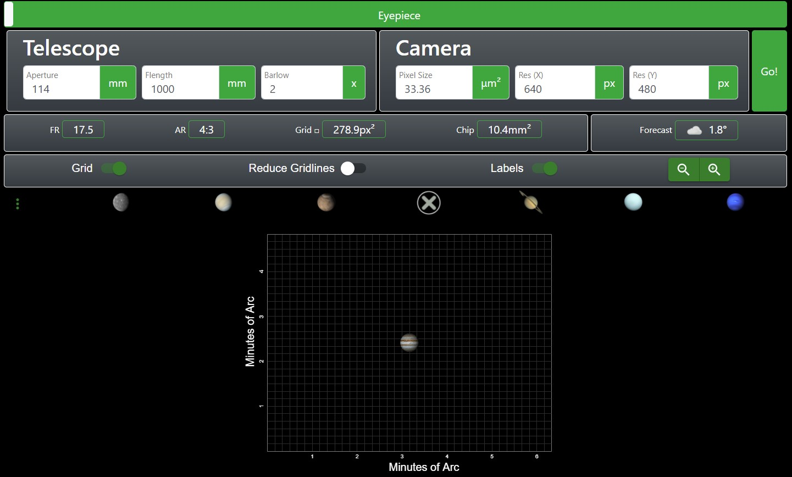

# True Field of View : A Web Tool for Amateur Astronomers

```diff
! a work in progress.. !
```

A web application for calculating and visualizing the true field-of-view of celestial objects based on your current astronomy setup (telescope, camera, and eyepiece). Get valuable information about the precise angular and visual diameter of dedicated celestial objects (and their respective astronomical units), choose different visualization options, check tonight's forecast in your current location, select presets off the shelf, and much more.

<p align="center">
 
</p>
